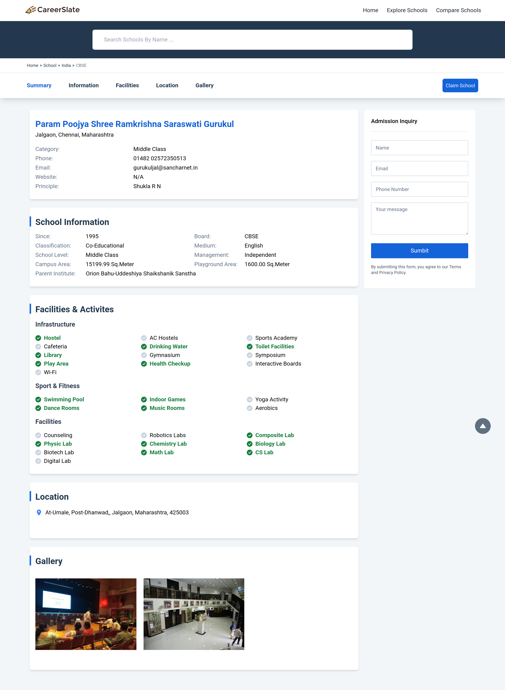

# CareerSlate

A School Discovery, Selection & Reviews Platform using ReactJs & Redux.

### Basic Overview [➥ Live Demo](https://careerslate.com/)

CareerSlate lets you explore nearby schools, compare and apply to them, within just a few clicks. We provide you with the quickest and easiest way to apply to as many schools of your choice from the comfort of your home.

- `React js` as a UI library.
- `Redux toolkit` for state management.
- `React router-V6` for routing.
- `Tailwind CSS` for styling.
- `Vite` for bundling.
- `Completely responsive UI`.
- `React testing library` for unit testing and integration testing.

## Features

- Implemented `filter`, `sorting`, `advanced search` functionality with `debouncing`, and `caching API hits` to optimize performance, resulting in a streamlined user experience.
- Developed highly `reusable components`, resulting in improved
  efficiency and `scalability` of the platform.
- Writing `unit tests`, `integration tests`, and helping define the overall testing strategy to achieve 100% code coverage.
- Creating mock back-end APIs using MirageJS to retrieve and
  display product information.
- Fully Responsive design.

## Screenshots

 

